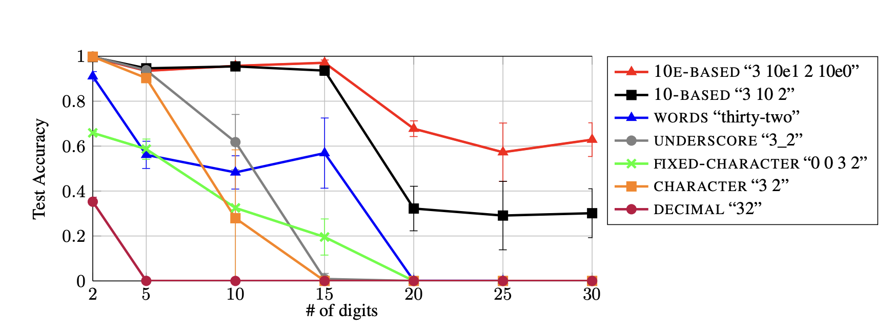

# How to Help Transformers Count

## Introduction

This repository reproduces the findings from “Investigating the Limitations of Transformers with Simple Arithmetic” by Rodrigo Nogueira, Zhiying Jiang, and Jimmy Lin. The paper investigates how different number representations affect transformer performance on addition and subtraction tasks. The authors train the T5 (Text-to-Text Transfer Transformer) models on synthetic arithmetic datasets using different tokenization schemes, including subword representation (e.g. “456”), character-level representation (e.g. “4 5 6”), and position-token representation (e.g. “4 10e2 5 10e1 6 10e0”).  

## Chosen Result
We specifically aimed to reproduce the finding that using position-token representations for addition and subtraction operations allowed the model to perform at a higher accuracy than subword and character-level representations. This result was the paper’s main contribution and demonstrates that model performance depends on numerical representation, rather than model scale or training size alone. The figure below is the findings from the original paper.

## GitHub Contents
This repository contains two .ipynb files. 
* Main.ipynb: Contains the code, which reproduces the paper, specifically generating the datasets, converting inputs into their proper numerical representation, fine-tuning the model with training datasets, and computing model performance with testing accuracy. 
* Generalize.ipynb: Contains code for testing how well the models generalize on addition problems using numbers of unseen lengths.

## Re-implementation Details

Models: HuggingFace [T5-Small](https://huggingface.co/google-t5/t5-small) and [T5-Base](https://huggingface.co/google-t5/t5-base) 

Training Set: Synthetically generate 1000 examples with operands of varying lengths using balanced sampling. 

Evaluation Set: Synthetically generate 1000 examples with operands of varying lengths using random sampling. 

Evaluation Metric: Exact accuracy between model prediction and label.

Re-implementation Approach:
* Fine-tune transformer model by training it on the training set.
* Evaluate model with testing set.

Challenges/Modifications: Because of Google Colab memory limts, we were constrained by our batch sizes and model input and output sequence length limits. We had to make modifications to the original approach by decreasing the batch size as well as model input and output max token sequence length.

## Reproduction Steps
**Note:** These Jupyter notebooks are best run in Google Colab to access GPU resources (T4 GPU). Upload the .ipynb files to Google Colab and ensure you have a Google Drive account for saving/loading models.

Main.ipynb:
* Connect to GPU (We used T4 GPU).
* In the 4th cell from the top, edit the desired details.
    * model_size: "t5-small" or "t5-base"
    * task: "add" or "subtract"
    * representation: "digit", "character", "fixed character", "underscore", "words", "10based", "10ebased"
    * D: maximum digit length, integer
    * n_samples: Number of training and testing samples, integer
    * output_dir_name: string name of folder to save model in after it has been fine-tuned
* Running the notebook from top to bottom will: 
    1. Generate training dataset.
    2. Fine-tune the selected model using the training set.
    3. Save the model to the desired location in Google Drive.
    4. Compute the model accuracy using the generated testing set.

Generalize.ipynb:
* Connect to GPU (We used T4 GPU).
* In the 4th cell from the top, edit the desired details.
    * model_size: "t5-small" or "t5-base"
    * task: "add" or "subtract"
    * representation: "digit", "character", "fixed character", "underscore", "words", "10based", "10ebased"
    * D: maximum digit length, integer
    * n_samples: Number of training and testing samples, integer
    * output_dir_name: string name of folder to save model in after it has been fine-tuned
* Running the notebook from top to bottom will: 
    1. Load the previously fine-tuned model saved in Google Drive.
    2. Generate testing dataset with numbers of specified digit D.
    3. Compute the model accuracy using the generated testing set.

## Results/Insights

These results support the paper’s argument that the surface form of number representations significantly impacts a transformer’s ability to learn arithmetic, and that tokenization is a component of current transformer designs that may need improvement.

Accuracy decreases as input digit length increases, indicating limited length generalization in addition tasks. The D=2 model generalizes relatively well to longer inputs likely because its constrained training distribution encourages the model to learn digit-wise arithmetic patterns rather than length-specific patterns. 

## Conclusion
Improving performance depends not just on using larger models, but on structuring inputs well. The way information is represented can determine whether a model learns real patterns or surface-level cues. Good encoding is just as important as model scale. 

## References
* Nogueira, R., Jiang, Z., & Lin, J. (2021). Investigating the limitations of transformers with simple arithmetic tasks. arXiv. https://arxiv.org/abs/2102.13019
* Raffel, C., Shazeer, N., Roberts, A., Lee, K., Narang, S., Matena, M., Zhou, Y., Li, W., & Liu, P. J. (2019). Exploring the Limits of Transfer Learning with a Unified Text-to-Text Transformer. arXiv:1910.10683. https://arxiv.org/abs/1910.10683 
* Thomas Wolf, Lysandre Debut, Victor Sanh, Julien Chaumond, Clement Delangue, Anthony Moi, Pierric Cistac, Tim Rault, Rémi Louf, Morgan Funtowicz, and Jamie Brew. (2019). HuggingFace’s Transformers: State-of-the-art Natural Language Processing. CoRR abs/1910.03771 (2019). arXiv:1910.03771 http://arxiv.org/abs/1910.03771

## Acknowledgements
We would like to thank the instructors and course staff of CS 4782 at Cornell University for their guidance and feedback throughout this project. Additionally, we acknowledge the authors of “Investigating the Limitations of Transformers with Simple Arithmetic” for providing the foundation of this re-implementation study.